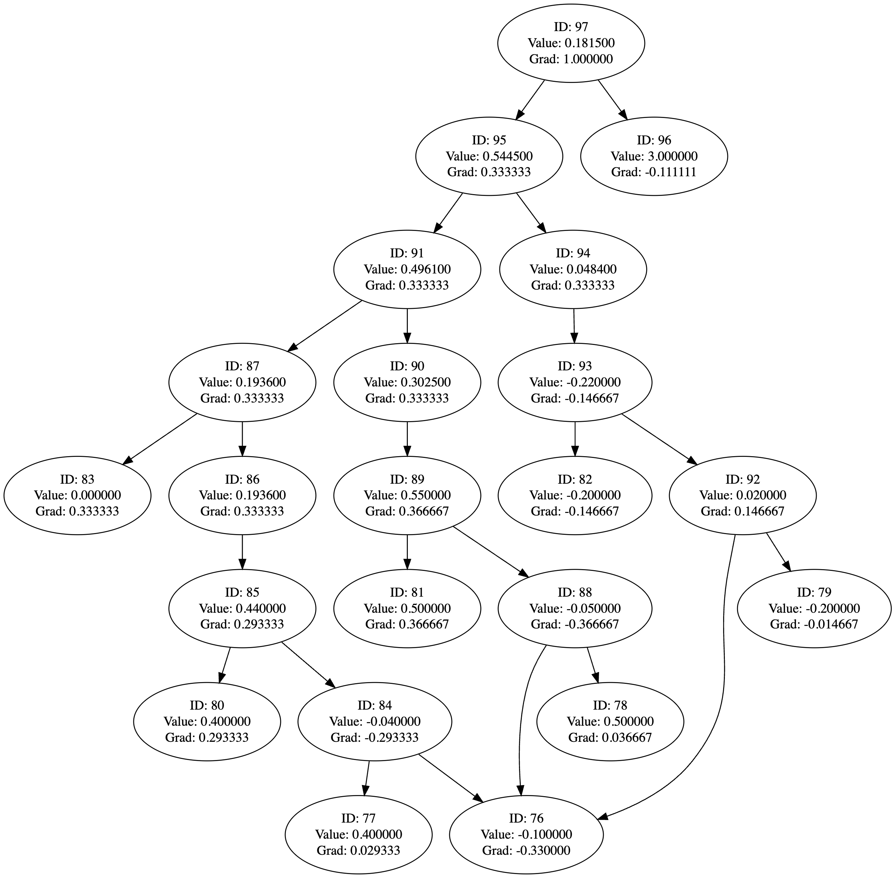

# Backprop
[](https://opensource.org/licenses/MIT)


Backprop is a library for automatically differentiation mathematical expressions.

## Usage
Add backprop.cpp as include in your project. Start by including the header file in your cmake file.
```cmake
include_directories("path/to/backprop")
```

Then include the header file in your source file.
```cpp
#include "backprop.h"
```

## Binary Classification Example
The following example demonstrates how to train a model to classify a binary dataset.
```bash
mkdir build
cd build
cmake ..
make
./and_example
```

## Tests
```bash
mkdir build
cd build
cmake ..
make
./tests/test_main
```

## Visualization of the Computational Graph
The computational graph can be visualized using the `write_dot` function, e.g.
```cpp
write_dot("graph.dot", loss);
```
Using a linear regression example, this is the graph generated:

<div align="center">
    
</div>